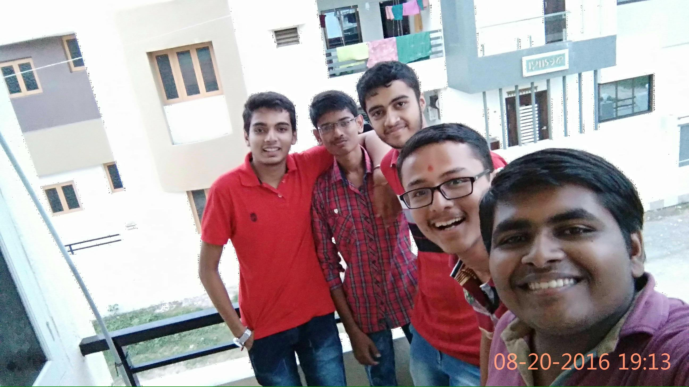
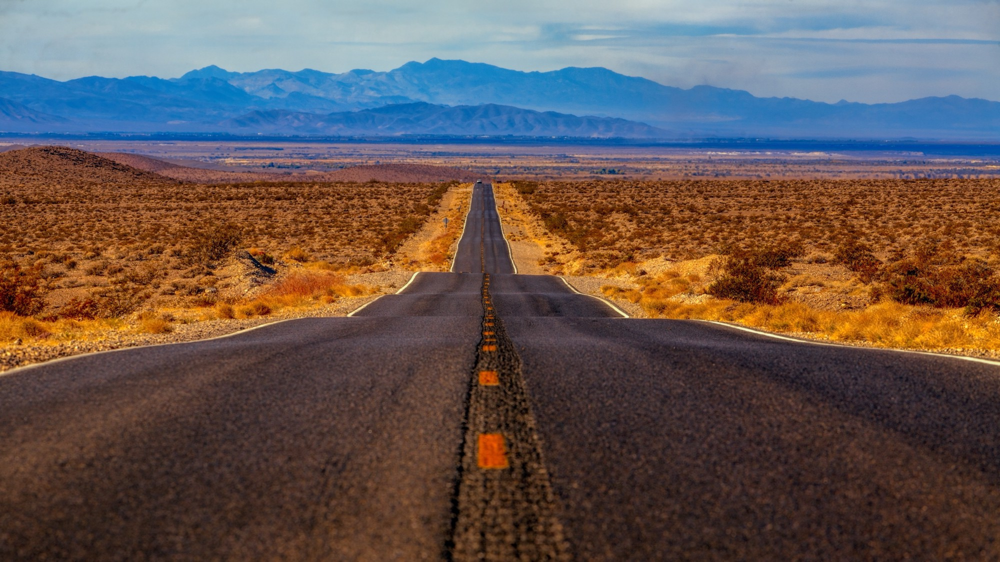
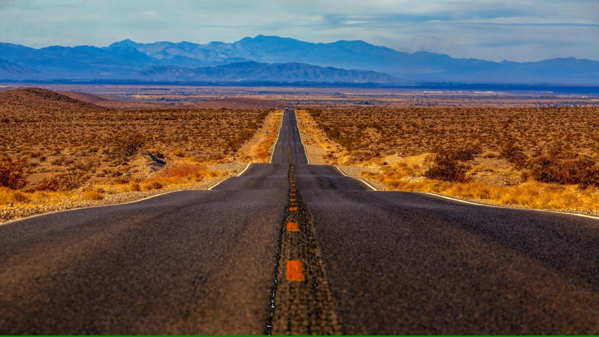

# image-optimizer
Optimize any image using techniques like <b>chroma subsampling</b> and <b>optimized huffman coding</b> etc.<br/>

## Introduction
Images we capture today, contains so much extra information that is not needed. <br/>
And also our human eye have some limitations. <br/>
So, removing what our eyes can't see is the basic idea. <br/>
Our eye is high sensitive to 'luma' than 'chroma'. So, according to that, image can be optimized.<br/>

## Advantage
The biggest advantage is <b>image resolution is not changed</b> during this optimization process.<br/>
Means if at first image is of size 1458 x 2592, then after optimization process, image resolution will be same 1458 x 2592.<br/>
But image size will be decresed or will remain same (if already optimized).<br/><br/>
And also, <b>image format is also kept same</b>. `png` images will be kept `png`, `jpeg` images will be kept `jpeg`.


## Setup
#### Frameworks and Packages
Make sure you have the following is installed:
 - [Python 3](https://www.python.org/)
 - [NumPy](http://www.numpy.org/)
 - [SciPy](https://www.scipy.org/)
 - PIL (Python Image Library)

## Usage
Give image path by command line argument.<br/>
```
python optimizer.py IMAGE_PATH
```
<br/>
Give relative image path inplace of IMAGE_PATH

## Sample performance
 - Before <b>size : 135 KB</b>.  Resolution : 1200 x 675<br/>
 <p align="center"></p>
 <br/>
 after <b>size : 119 KB</b>. Resolution : 1200 x 675<br/>Resolution is still same. But size is decresed.<br/>
 <p align="center"></p>
 
 - Before <b>size : 3358 KB</b>.  Resolution : 4208 x 2368<br/>
 <p align="center"></p>
 <br/>
 after <b>size : 960 KB</b>.  Resolution : 4208 x 2368<br/>Resolution is still same. But size is decresed by ~70%<br/>
 <p align="center"></p>
 
 - Before <b>size : 1482 KB</b>.  Resolution : 2592 x 1458<br/>
 <p align="center"></p>
 <br/>
 after <b>size : 396 KB</b>.  Resolution : 2592 x 1458<br/>Resolution is still same. But size is decresed by ~70%<br/>
 <p align="center"></p>
 
 - Before <b>size : 566 KB</b>.  Resolution : 2000 x 1125<br/>
 <p align="center"></p>
 <br/>
 after <b>size : 331 KB</b>.  Resolution : 2000 x 1125<br/>Resolution is still same. But size is decresed.<br/>
 <p align="center"></p>
 
## Future improvements
Average time for optimizing a 1280 x 720 image is around 2 minutes. That is very long.<br/>
I will try to reduce that time.
